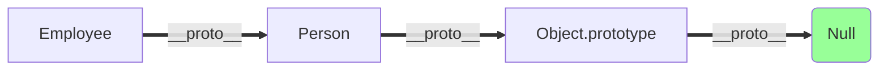
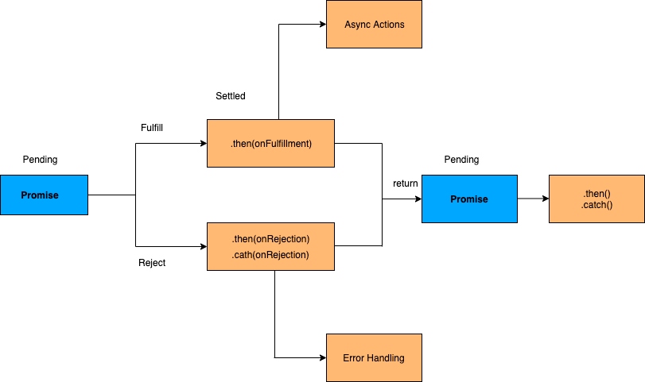

# JavaScript Fragen

## Prototype Chain?

Eine **Prototype Chain** wird verwendet, um neue Objekttypen auf der Grundlage bestehender Objekte zu erstellen. 
Sie ist vergleichbar mit der Vererbung in einer klassenbasierten Sprache.

Der Prototyp einer Objektinstanz ist über **Object.getPrototypeOf(object)** oder die Eigenschaft **\_\_proto__** verfügbar, 
während der Prototyp einer Konstruktorfunktion über **Object.prototype** verfügbar ist.



## Was ist JSON

**JSON** ist ein textbasiertes Datenformat, das der JavaScript-Objektsyntax folgt und von `Douglas Crockford` populär 
gemacht wurde. Es ist nützlich, wenn Sie Daten über ein Netzwerk übertragen wollen und es ist im Grunde nur eine 
Textdatei mit der Erweiterung .json und dem MIME-Typ application/json

**Parsing:** Umwandlung einer Zeichenkette in ein natives Objekt

   ```javascript
   JSON.parse(text);
   ```

**Stringification:** Konvertierung eines nativen Objekts in eine Zeichenkette, damit es über das Netz übertragen werden kann

   ```javascript
   JSON.stringify(object);
   ```

## Array-Slice-Methode
Die Methode `slice()` gibt die ausgewählten Elemente eines Arrays als neues Array-Objekt zurück. Sie wählt die Elemente 
aus, die mit dem angegebenen Start-Argument beginnen und mit dem angegebenen optionalen End-Argument enden, ohne das 
letzte Element einzuschließen. Wenn Sie das zweite Argument weglassen, werden die Elemente bis zum Ende ausgewählt.

## Array-Splice-Methode
Die Methode `splice()` wird verwendet, um Elemente zu einem Array hinzuzufügen oder daraus zu entfernen und dann das 
entfernte Element zurückzugeben. Das erste Argument gibt die Array-Position für das Einfügen oder Löschen an, während 
das optionale zweite Argument die Anzahl der zu löschenden Elemente angibt. Jedes weitere Argument wird dem Array 
hinzugefügt.

## Unterschied: Slice und Splice?

| Slice | Splice |
| -------------------------------------------- | ----------------------------------------------- |
| Verändert das ursprüngliche Array nicht (unveränderlich) | Verändert das ursprüngliche Array (veränderlich) |
| Gibt die Teilmenge des ursprünglichen Arrays zurück | Gibt die gelöschten Elemente als Array zurück |
| Verwendet, um Elemente aus einem Array auszuwählen | Verwendet, um Elemente in/aus einem Array einzufügen oder zu löschen |

## Gleichheitsvergleiche (== und ===)

JavaScript bietet sowohl `strikte` (===, !==) als auch `typkonvertierende` (==, !=) Gleichheitsvergleiche. 

Die strikten Operatoren berücksichtigen den Typ der Variablen, während die nicht-strikten Operatoren 
eine Typkorrektur/-umwandlung auf der Grundlage der Variablenwerte vornehmen. Die strikten Operatoren 
folgen den unten aufgeführten Bedingungen für verschiedene Typen.

```javascript
0 == false   // true
0 === false  // false
1 == "1"     // true
1 === "1"    // false
null == undefined // true
null === undefined // false
'0' == false // true
'0' === false // false
[]==[] or []===[] //false, verweist auf verschiedene Objekte im Speicher
{}=={} or {}==={} //false, verweist auf verschiedene Objekte im Speicher
```

## Double Exclamation

Das doppelte Ausrufezeichen oder die Negation(!!) stellt sicher, dass der resultierende Typ ein Boolescher ist. 
Wenn er falsch war (z. B. 0, null, undefiniert usw.), ist er falsch, andernfalls ist er wahr.

```javascript
let isIE8 = false;
isIE8 = !!navigator.userAgent.match(/MSIE 8.0/);
console.log(isIE8); // returns true or false
```

## Conditional Operator

Der bedingte (ternäre) Operator ist der einzige JavaScript-Operator, der drei Operanden benötigt und als Abkürzung für if-Anweisungen dient.

```javascript
var isAuthenticated = false;
console.log(
    isAuthenticated ? "Hello, welcome" : "Sorry, you are not authenticated"
); //Sorry, you are not authenticated
```

## isNaN

Die Funktion isNaN() wird verwendet, um festzustellen, ob es sich bei einem Wert um eine ungültige Zahl (Not-a-Number) 
handelt oder nicht. d.h. diese Funktion gibt true zurück, wenn der Wert NaN entspricht. 
Andernfalls gibt sie false zurück.

```javascript
isNaN("Hello"); //true
isNaN("100"); //false
```

## `undefined` Eigenschaft

Die Eigenschaft undefiniert zeigt an, dass einer Variablen kein Wert zugewiesen wurde oder dass sie zwar deklariert, 
aber nicht initialisiert wurde. Der Typ des undefinierten Wertes ist ebenfalls undefiniert.

```javascript
var user; // Value is undefined, type is undefined
console.log(typeof user); //undefined
```

## `null` Wert

Der Wert null steht für das absichtliche Fehlen eines Objektwerts. Er ist einer der primitiven Werte von JavaScript. 
Der Typ des Wertes null ist ein Objekt. Sie können die Variable leeren, indem Sie den Wert auf null setzen.

```javascript
var user = null;
console.log(typeof user); //object
```

## Unterschied: `null` und `undefined`?

| `null` | `undefined`                                                                                                                        |
| ------------------------------------------- |------------------------------------------------------------------------------------------------------------------------------------|
| Es ist ein Zuweisungswert, der anzeigt, dass die Variable auf kein Objekt zeigt. | Es handelt sich nicht um einen Zuweisungswert, bei dem eine Variable zwar deklariert, aber noch nicht mit einem Wert belegt wurde. |
| Typ der Null ist Objekt| Typ von undefiniert ist undefiniert                                                                                                |
| Der Nullwert ist ein primitiver Wert, der die null, leere oder nicht vorhandene Referenz darstellt. | Der undefinierte Wert ist ein primitiver Wert, der verwendet wird, wenn einer Variablen noch kein Wert zugewiesen wurde.           | 
| Zeigt das Fehlen eines Wertes für eine Variable an | Zeigt an, dass die Variable selbst nicht vorhanden ist                                                                             |
| Bei der Durchführung primitiver Operationen in Null (0) umgewandelt | Bei der Durchführung primitiver Operationen in NaN umgewandelt                                                                     |

## Arrow Function: lambda, Fat Arrow

Eine `Arrow Function` ist eine kürzere Syntax für einen Funktionsausdruck und hat kein eigenes `this`, `arguments`, `super` oder 
`new.target`. 

Diese Funktionen sind am besten für Nicht-Methodenfunktionen geeignet und können nicht als Konstruktoren 
verwendet werden.

```javascript
 let obj = {
    value: 10,
    add: function(x: number) {
        // In dieser traditionellen Funktion wird "this" während der Ausführung
        // festgelegt und hängt davon ab, wie die Funktion aufgerufen wird
        return this.value + x;
    },
    addArrow: (x: number) => {
        // In dieser Arrow Function wird "this" an den Lexikalischen Bereich gebunden,
        // in dem die Funktion definiert wurde, und hat immer denselben Wert
        return this.value + x;
    }
};

console.log(obj.add(5)); // Ausgabe: 15
console.log(obj.addArrow(5)); // Ausgabe: NaN (this.value ist nicht definiert)
```

## First Class Function

In Javascript sind Funktionen Objekte erster Klasse. Erstklassige Funktionen bedeuten, dass Funktionen in dieser 
Sprache wie jede andere Variable behandelt werden.

In einer solchen Sprache kann eine Funktion beispielsweise als Argument an andere Funktionen übergeben werden, 
von einer anderen Funktion zurückgegeben werden und einer Variablen als Wert zugewiesen werden. 
Im folgenden Beispiel werden beispielsweise einem Hörer Handler-Funktionen zugewiesen:

```javascript
const handler = () => console.log("This is a click handler function");
document.addEventListener("click", handler);
```

## First Order Function

Eine Funktion höherer Ordnung ist eine Funktion, die eine andere Funktion als Argument akzeptiert oder eine Funktion 
als Rückgabewert zurückgibt oder beides.

```javascript
const firstOrderFunc = () =>
    console.log("Hello, I am a First order function");
const higherOrder = (ReturnFirstOrderFunc) => ReturnFirstOrderFunc();
higherOrder(firstOrderFunc);
```

## Currying Functions

Currying ist der Prozess, bei dem eine Funktion mit mehreren Argumenten in eine Folge von Funktionen mit jeweils nur 
einem Argument umgewandelt wird. Currying ist nach dem Mathematiker **Haskell Curry** benannt. Durch Anwendung von 
Currying wird eine n-äre Funktion in eine unäre Funktion umgewandelt.

Nehmen wir ein Beispiel für eine n-äre Funktion und wie sie sich in eine Currying-Funktion verwandelt:

```javascript
const multiArgFunction = (a, b, c) => a + b + c;
console.log(multiArgFunction(1, 2, 3)); // 6

const curryUnaryFunction = (a) => (b) => (c) => a + b + c;
curryUnaryFunction(1); // returns a function: b => c =>  1 + b + c
curryUnaryFunction(1)(2); // returns a function: c => 3 + c
curryUnaryFunction(1)(2)(3); // returns the number 6
```

## Callback Function

Eine Callback-Funktion ist eine Funktion, die einer anderen Funktion als Argument übergeben wird.
Diese Funktion wird innerhalb der äußeren Funktion aufgerufen, um eine Aktion abzuschließen.

```javascript
function callbackFunction(name) {
    console.log("Hello " + name);
}

function outerFunction(callback) {
    let name = prompt("Please enter your name.");
    callback(name);
}

outerFunction(callbackFunction);
```

## Scope

Der Geltungsbereich ist die Zugänglichkeit von Variablen, Funktionen und Objekten in einem bestimmten Teil Ihres Codes 
während der Laufzeit. 

Mit anderen Worten, der Geltungsbereich bestimmt die Sichtbarkeit von Variablen und anderen Ressourcen in Bereichen Ihres Codes.

## Spread-Syntax

Die Spread-Syntax in JavaScript ermöglicht es, Elemente aus einem Array oder einem iterierbaren Objekt in eine Liste 
von Elementen aufzuteilen. 

Sie wird durch drei Punkte `...` gekennzeichnet. Diese Syntax wird oft verwendet, 
um Arrays zu klonen oder zu vereinen, oder um individuelle Elemente aus einem Array als Argumente für eine Funktion zu übergeben.

```javascript
let array1 = [1, 2, 3];
let array2 = [4, 5, 6];

let combinedArray = [...array1, ...array2];
// combinedArray ist [1, 2, 3, 4, 5, 6]
```

## Hoisting

Hoisting ist ein JavaScript-Mechanismus, bei dem Variablen, Funktionsdeklarationen und Klassen vor der Codeausführung an 
den Anfang ihres Bereichs verschoben werden. Denken Sie daran, dass JavaScript nur Deklarationen, nicht aber die 
Initialisierung anhebt. Nehmen wir ein einfaches Beispiel für Variablen-Histing,

```javascript
console.log(message); //output : undefined
var message = "The variable Has been hoisted";
```

Der obige Code sieht für den Interpreter wie folgt aus,

```javascript
var message;
console.log(message);
message = "The variable Has been hoisted";
```

Auf die gleiche Weise werden auch Funktionsdeklarationen hochgezogen

```javascript
message("Good morning"); //Good morning

function message(name) {
    console.log(name);
}
```

Dadurch können Funktionen sicher im Code verwendet werden, bevor sie deklariert werden.


## `let` und `var`

| var                              | let                                  |
|----------------------------------|--------------------------------------|
| seit den Anfängen von JavaScript | wurde als Teil von ES6 eingeführt    |
| Function Scope                   | Block Scope                          |
| Variablen Hoisting               | Hoisting, aber nicht initialisiert   |

```javascript
function userDetails(username) {
    if (username) {
        console.log(salary); // undefined due to hoisting
        console.log(age); // ReferenceError: Cannot access 'age' before initialization
        let age = 30;
        var salary = 10000;
    }
    console.log(salary); //10000 (accessible due to function scope)
    console.log(age); //error: age is not defined(due to block scope)
}
userDetails("John");
```

## Temporal Dead Zone
Die Temporal Dead Zone ist ein Verhalten in JavaScript, das auftritt, wenn eine Variable mit den Schlüsselwörtern `let` und `const`, 
aber nicht mit `var deklariert wird. 

In ECMAScript 6 führt der Zugriff auf eine `let`- oder `const`-Variable vor ihrer Deklaration (innerhalb ihres Gültigkeitsbereichs) 
zu einem ReferenceError. Die Zeitspanne zwischen der Erstellung der Bindung einer Variablen und ihrer Deklaration, in der 
dies geschieht, wird als Temporal Dead Zone bezeichnet.

```javascript
function somemethod() {
    console.log(counter1); // undefined
    console.log(counter2); // ReferenceError
    var counter1 = 1;
    let counter2 = 2;
}
```

##  IIFE(Immediately Invoked Function Expression)

IIFE (Immediately Invoked Function Expression) ist eine JavaScript-Funktion, die ausgeführt wird, sobald sie definiert ist. Die Signatur lautet wie folgt,

```javascript
(function () {
    // logic here
})();
```

Der Hauptgrund für die Verwendung eines IIFE ist die Wahrung des Datenschutzes, da auf die innerhalb des IIFE deklarierten 
Variablen von außen nicht zugegriffen werden kann, d. h., wenn Sie versuchen, mit einem IIFE auf Variablen zuzugreifen, 
wird ein Fehler (siehe unten) ausgegeben,

```javascript
(function () {
    var message = "IIFE";
    console.log(message);
})();
console.log(message); //Error: message is not defined
```

## Closures

Eine Closure ist die Kombination aus einer Funktion und der lexikalischen Umgebung, in der diese Funktion deklariert wurde,
d.h. sie ist eine innere Funktion, die Zugriff auf die Variablen der äußeren oder umschließenden Funktion hat. 

Die Closure hat drei Scope-Ketten

- Eigener Bereich, in dem die Variablen zwischen den geschweiften Klammern definiert sind
- die Variablen der äußeren Funktion
- Globale Variablen

```javascript
function Welcome(name) {
    var greetingInfo = function (message) {
        console.log(message + " " + name);
    };
    return greetingInfo;
}
var myFunction = Welcome("John");
myFunction("Welcome "); //Output: Welcome John
myFunction("Hello Mr."); //output: Hello Mr.John
```

Gemäß dem obigen Code hat die innere Funktion (d. h. greetingInfo) Zugriff auf die Variablen im äußeren Funktionsbereich 
(d. h. Welcome), auch nachdem die äußere Funktion zurückgekehrt ist.

## `setTimeout` Funktion

Die Methode setTimeout() wird verwendet, um eine Funktion aufzurufen oder einen Ausdruck nach einer bestimmten Anzahl 
von Millisekunden auszuwerten.

```javascript
setTimeout(function () {
    console.log("Good morning");
}, 2000);
```

## `clearTimeout` Methode

Die Funktion clearTimeout() wird in Javascript verwendet, um die Zeitüberschreitung zu löschen, die zuvor durch die 
Funktion setTimeout() gesetzt wurde. D.h., der Rückgabewert der Funktion setTimeout() wird in einer Variablen gespeichert 
und an die Funktion clearTimeout() übergeben, um den Timer zu löschen.

```javascript
<script>
    var msg;
    function greeting() {
    alert('Good morning');
}
    function start() {
    msg =setTimeout(greeting, 3000);

}

    function stop() {
    clearTimeout(msg);
}
</script>
```

## `setInterval` Funktion

Die Methode setInterval() wird verwendet, um eine Funktion aufzurufen oder einen Ausdruck in bestimmten Intervallen 
(in Millisekunden) auszuwerten.

```javascript
setInterval(function () {
    console.log("Good morning");
}, 2000);
```

## `clearInterval` Methode

Die Funktion clearInterval() wird in Javascript verwendet, um das Intervall zu löschen, das mit der Funktion setInterval() 
gesetzt wurde. D.h. der von der Funktion setInterval() zurückgegebene Wert wird in einer Variablen gespeichert und 
an die Funktion clearInterval() übergeben, um das Intervall zu löschen.

```javascript
<script>
    var msg;
    function greeting() {
    alert('Good morning');
}
    function start() {
    msg = setInterval(greeting, 3000);

}

    function stop() {
    clearInterval(msg);
}
</script>
```

## Promise

Ein Versprechen ist ein Objekt, das irgendwann in der Zukunft einen einzelnen Wert mit einem aufgelösten Wert oder einem
Grund für die Nichtauflösung (z. B. ein Netzwerkfehler) liefern kann. Es wird sich in einem der 3 möglichen Zustände befinden:
erfüllt, abgelehnt oder ausstehend.

```javascript
const promise = new Promise(function (resolve, reject) {
    // promise description
});
```



```javascript
const promise = new Promise(
    (resolve) => {
        setTimeout(() => {
            resolve("I'm a Promise!");
        }, 5000);
    },
    (reject) => {}
);

promise.then((value) => console.log(value));
```

## Zustände einer Promise

- `Pending`: Dies ist der Ausgangszustand des Promise, bevor ein Vorgang beginnt
- `Fulfilled`: Dieser Zustand zeigt an, dass der angegebene Vorgang abgeschlossen wurde.
- `Rejected`: Dieser Zustand zeigt an, dass der Vorgang nicht abgeschlossen werden konnte. In diesem Fall wird ein Fehlerwert ausgelöst.

## Promise Regeln

- Eine Promise ist ein Objekt, das eine standardkonforme `.then()`-Methode bereitstellt.
- Eine ausstehende Promise kann entweder in einen erfüllten oder abgelehnten Zustand übergehen.
- Eine erfüllte oder abgelehnte Promise ist abgeschlossen und darf nicht in einen anderen Zustand übergehen.
- Sobald eine Promise erfüllt ist, darf sich der Wert nicht mehr ändern.

### Promise Chaining

Der Prozess der Ausführung einer Folge von asynchronen Aufgaben nacheinander unter Verwendung von Promise.

```javascript
new Promise(function (resolve, reject) {
    setTimeout(() => resolve(1), 1000);
})
    .then(function (result) {
        console.log(result); // 1
        return result * 2;
    })
    .then(function (result) {
        console.log(result); // 2
        return result * 3;
    })
    .then(function (result) {
        console.log(result); // 6
        return result * 4;
    });
```

## Promise.all

Promise.all ist ein Versprechen, das ein Array von Versprechen als Eingabe nimmt (eine Iterable), und es wird aufgelöst,
wenn alle Versprechen aufgelöst werden oder eines von ihnen zurückgewiesen wird.

```javascript
Promise.all([Promise1, Promise2, Promise3])
    .then(result) => { console.log(result) }
    .catch(error => console.log(`Error in promises ${error}`))
```

## Promise.race

Die Methode Promise.race() gibt die Promiseinstanz zurück, die zuerst aufgelöst oder abgelehnt wird.

```javascript
var promise1 = new Promise(function (resolve, reject) {
    setTimeout(resolve, 500, "one");
});
var promise2 = new Promise(function (resolve, reject) {
    setTimeout(resolve, 100, "two");
});

Promise.race([promise1, promise2]).then(function (value) {
    console.log(value);  // "two" 
    // Both promises will resolve, but promise2 is faster
});
```

## Single Threaded
Warum wird JavaScript als Single Threaded behandelt?

JavaScript ist eine Single-Thread-Sprache. Denn die Sprachspezifikation erlaubt es dem Programmierer nicht, Code so zu schreiben, 
dass der Interpreter Teile davon parallel in mehreren Threads oder Prozessen ausführen kann. Sprachen wie Java, Go und C++ 
können dagegen Multi-Thread- und Multiprozess-Programme erstellen.

## App Shell Model

Eine Application-Shell-Architektur (oder App-Shell-Architektur) ist eine Möglichkeit, eine Progressive Web App zu erstellen, 
die zuverlässig und sofort auf den Bildschirmen Ihrer Benutzer geladen wird, ähnlich wie bei nativen Anwendungen. Sie ist nützlich, 
um einige anfängliche HTML-Inhalte schnell und ohne Netzwerk auf den Bildschirm zu bringen.

## Polyfill

Ein Polyfill ist ein Stück JS-Code, das verwendet wird, um moderne Funktionen in älteren Browsern bereitzustellen, 
die diese nicht von Haus aus unterstützen. Zum Beispiel kann ein Silverlight-Plugin-Polyfill verwendet werden, 
um die Funktionalität eines HTML-Canvas-Elements im Microsoft Internet Explorer 7 zu imitieren.

## Tree Shaking

Tree Shaking ist eine Form der Eliminierung von totem Code. Es bedeutet, dass ungenutzte Module während des Build-Prozesses 
nicht in das Bundle aufgenommen werden und stützt sich dabei auf die statische Struktur der ES2015-Modulsyntax (d.h. Import und Export). 
Ursprünglich wurde dies durch das ES2015 Module Bundler `rollup` populär gemacht.

## Warum Tree Shaking

Tree Shaking kann die Codegröße in jeder Anwendung erheblich reduzieren, d.h. je weniger Code wir über die Leitung senden, 
desto leistungsfähiger wird die Anwendung. Wenn wir zum Beispiel nur eine "Hello World"-Anwendung mit SPA-Frameworks 
erstellen wollen, benötigt sie einige MB, aber durch Tree Shaking kann die Größe auf nur einige hundert KB reduziert werden. 
Tree Shaking ist in den Rollup- und Webpack-Bundlern implementiert.

## Regular Expression

Ein regulärer Ausdruck ist eine Folge von Zeichen, die ein Suchmuster bilden. Sie können dieses Suchmuster für die Suche 
nach Daten in einem Text verwenden. Damit lassen sich alle Arten von Textsuch- und Textersetzungsoperationen durchführen. 

siehe RegEx

