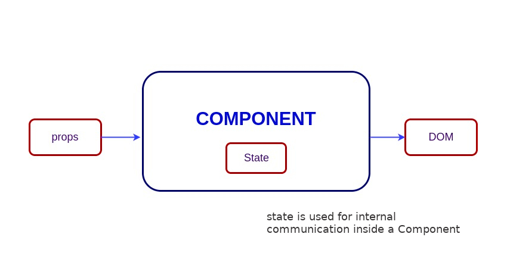
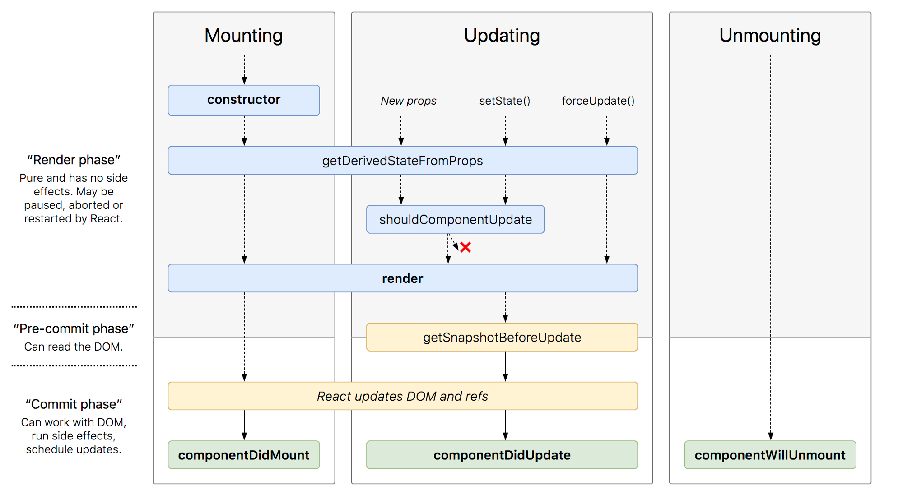
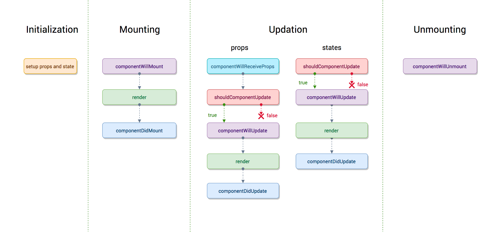
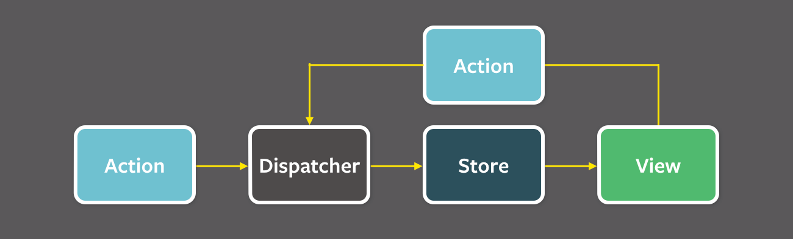

# React Fragen

## Hauptmerkmale

- Verwendet JSX-Syntax, eine Syntaxerweiterung von JS, die es Entwicklern ermöglicht, HTML in ihren JS-Code zu schreiben.
- Verwendet virtuelles DOM anstelle von realem DOM, da reale DOM-Manipulationen teuer sind.
- Unterstützt serverseitiges Rendering, was für die Suchmaschinenoptimierung (SEO) nützlich ist.
- Folgt unidirektionalem oder einseitigem Datenfluss oder Datenbindung.
- Verwendet wiederverwendbare/komponierbare UI-Komponenten zur Entwicklung der Ansicht.

## JSX

`JSX` steht für `JavaScript XML` und ist eine XML-ähnliche Syntaxerweiterung zu ECMAScript. 
Im Grunde bietet es nur den syntaktischen Zucker für die Funktion `React.createElement(type, props, ...children), 
die uns die Ausdruckskraft von JavaScript zusammen mit einer HTML-ähnlichen Template-Syntax bietet.

Im folgenden Beispiel wird der Text im `<h1>`-Tag als JavaScript-Funktion an die Render-Funktion zurückgegeben.

```javascript
export default function App() {
  return (
      <h1 className="greeting">{"Hello, this is a JSX Code!"}</h1>
  );
}
```

Wenn Sie die JSX-Syntax nicht verwenden, sollte der entsprechende JavaScript-Code wie folgt geschrieben werden,

```javascript
import { createElement } from 'react';

export default function App() {
    return createElement(
        'h1',
        { className: 'greeting' },
        'Hello, this is a JSX Code!'
    );
}
```

**Hinweis**: JSX ist strenger als HTML

## Unterschied Element und Component

Ein **Element** ist ein einfaches Objekt, das beschreibt, was auf dem Bildschirm in Form von DOM-Knoten oder anderen Komponenten 
erscheinen soll. Elemente können andere Elemente in ihren Requisiten enthalten. Die Erstellung eines React-Elements ist billig. 
Sobald ein Element erstellt ist, kann es nicht mehr verändert werden (mutated).

Die JavaScript-Darstellung (ohne JSX) des React-Elements würde wie folgt aussehen:

```javascript
const element = React.createElement("div", { id: "login-btn" }, "Login");
```

und dieses Element kann mit JSX simuliert werden

```javascript
<div id="login-btn">Login</div>
```

Die obige Funktion `React.createElement() gibt ein Objekt wie unten dargestellt zurück:

```javascript
{
    type: 'div',
        props: {
        children: 'Login',
            id: 'login-btn'
    }
}
```

Schließlich wird dieses Element mit `ReactDOM.render()` in das DOM übertragen.

Eine **Komponente** kann auf verschiedene Arten deklariert werden. Sie kann eine Klasse mit einer render()-Methode sein oder 
sie kann als Funktion definiert werden. In jedem Fall nimmt sie props als Eingabe und gibt einen JSX-Baum als 
Ausgabe zurück:

```javascript
const Button = ({ handleLogin }) => (
    <div id={"login-btn"} onClick={handleLogin}>
        Login
    </div>
);
```

Dann wird JSX in einen `React.createElement()`-Funktionsbaum umgewandelt:

```javascript
const Button = ({ handleLogin }) =>
    React.createElement(
        "div",
        { id: "login-btn", onClick: handleLogin },
        "Login"
    );
```

## Pure Components

Pure Components sind die Komponenten, die für den gleichen Zustand und die gleichen Props die gleiche Ausgabe liefern. 

In Funktionskomponenten können Sie diese reinen Komponenten durch die memoisierte `React.memo()-API erreichen, die die Komponente 
umhüllt. Diese API verhindert unnötige erneute Renderings, indem sie die vorherigen Props und die neuen Props mit einem flachen 
Vergleich vergleicht. Dies ist hilfreich für Leistungsoptimierungen.

Gleichzeitig wird jedoch nicht der vorherige Zustand mit dem aktuellen Zustand verglichen, da die Funktionskomponente selbst 
das unnötige Rendering standardmäßig verhindert, wenn Sie denselben Zustand erneut einstellen.

## States

Der State oder auch Zustand einer Komponente ist ein Objekt, das einige Informationen enthält, die sich während der Lebensdauer 
der Komponente ändern können. Der wichtige Punkt ist, dass sich die Komponente immer dann neu aufbaut, wenn sich das 
Statusobjekt ändert. Es ist immer empfehlenswert, den Zustand so einfach wie möglich zu gestalten und die Anzahl der 
zustandsabhängigen Komponenten zu minimieren.



```javascript
import React, { useState } from "react";

function User() {
    const [message, setMessage] = useState("Welcome to React world");

    return (
        <div>
            <h1>{message}</h1>
        </div>
    );
}
```
## Props

Props sind Eingaben für Komponenten. Sie sind einzelne Werte oder Objekte mit einer Reihe von Werten, die bei der 
Erstellung an Komponenten weitergegeben werden, ähnlich wie HTML-Tag-Attribute. Hier werden die Daten von einer übergeordneten 
Komponente an eine untergeordnete Komponente weitergegeben.

Der Hauptzweck von Props in React besteht darin, die folgenden Komponentenfunktionen bereitzustellen:

- Übergeben Sie benutzerdefinierte Daten an Ihre Komponente.
- Auslösen von Zustandsänderungen.
- Verwendung über `this.props.reactProp` innerhalb der `render()-Methode der Komponente.


```javascript
import React, { useState } from "react";

function User() {
    const [message, setMessage] = useState("Welcome to React world");

    return (
        <div>
            <h1>{message}</h1>
        </div>
    );
}
```

## Refs

Der `ref` wird verwendet, um einen Verweis auf das Element zurückzugeben. 
Sie sollten in den meisten Fällen vermieden werden, können aber nützlich sein, wenn Sie einen direkten Zugriff auf das 
DOM-Element oder eine Instanz einer Komponente benötigen.

## Forward Refs

Forward Refs ist eine Funktion, die es einigen Komponenten ermöglicht, einen empfangenen Ref zu übernehmen 
und ihn an ein untergeordnetes Element weiterzuleiten.

## Virtueller DOM

Der virtuelle DOM (VDOM) ist eine speicherinterne Darstellung des realen DOM. Die Darstellung einer Benutzeroberfläche 
wird im Speicher gehalten und mit dem "echten" DOM synchronisiert. Dies ist ein Schritt, der zwischen dem Aufruf der 
Render-Funktion und der Anzeige der Elemente auf dem Bildschirm erfolgt. Dieser gesamte Prozess wird als Reconciliation 
bezeichnet.

Der virtuelle DOM funktioniert in drei einfachen Schritten.

1. Immer wenn sich die zugrunde liegenden Daten ändern, wird die gesamte Benutzeroberfläche in der virtuellen 
DOM-Darstellung neu gerendert.
2. Dann wird die Differenz zwischen der vorherigen DOM-Darstellung und der neuen berechnet.
3. Sobald die Berechnungen abgeschlossen sind, wird der reale DOM nur mit den Dingen aktualisiert, 
die sich tatsächlich geändert haben.

## Shadow DOM and Virtual DOM

Der Shadow DOM ist eine Browsertechnologie, die in erster Linie für das Scoping von Variablen und CSS in Webkomponenten 
entwickelt wurde. 
Der virtuelle DOM ist ein Konzept, das von Bibliotheken in JavaScript auf den Browser-APIs implementiert wird.

## React Fiber

Fiber ist die neue Reconciliation-Engine bzw. die Neuimplementierung des Core-Algorithmus in React v16. 
Das Ziel von React Fiber ist es, seine Eignung für Bereiche wie Animation, Layout, Gesten, die Fähigkeit, Arbeit anzuhalten, 
abzubrechen oder wiederzuverwenden und verschiedenen Arten von Aktualisierungen Priorität zuzuweisen, 
sowie neue Gleichzeitigkeits-Primitive zu verbessern.

- Fähigkeit, unterbrechbare Arbeit in Stücke aufzuteilen.
- Fähigkeit zur Priorisierung, Re-Base und Wiederverwendung von laufender Arbeit.
- Fähigkeit, zwischen Eltern und Kindern hin- und herzuwechseln, um das Layout in React zu unterstützen.
- Die Möglichkeit, mehrere Elemente von render() zurückzugeben.
- Bessere Unterstützung für Fehlergrenzen.

## Kontrollierte Komponenten

Eine Komponente, die die Eingabeelemente innerhalb der Formulare bei nachfolgenden Benutzereingaben steuert, wird als 
Controlled Component bezeichnet, d.h. jede Zustandsmutation hat eine zugehörige Handler-Funktion.

```javascript
handleChange(event) {
    this.setState({value: event.target.value.toUpperCase()})
}
```

## Unkontrollierte Komponenten

Die unkontrollierten Komponenten sind diejenigen, die ihren eigenen Zustand intern speichern, und Sie fragen das DOM mit 
einem ref ab, um ihren aktuellen Wert zu finden, wenn Sie ihn brauchen. 
Das ist ein bisschen mehr wie traditionelles HTML.

```javascript
class UserProfile extends React.Component {
    constructor(props) {
        super(props);
        this.handleSubmit = this.handleSubmit.bind(this);
        this.input = React.createRef();
    }

    handleSubmit(event) {
        alert("A name was submitted: " + this.input.current.value);
        event.preventDefault();
    }

    render() {
        return (
            <form onSubmit={this.handleSubmit}>
                <label>
                    {"Name:"}
                    <input type="text" ref={this.input} />
                </label>
                <input type="submit" value="Submit" />
            </form>
        );
    }
}
```

In den meisten Fällen ist es empfehlenswert, kontrollierte Komponenten für die Implementierung von Formularen zu verwenden. 
In einer kontrollierten Komponente werden die Formulardaten von einer React-Komponente verarbeitet. 

Die Alternative sind unkontrollierte Komponenten, bei denen die Formulardaten durch das DOM selbst verarbeitet werden.


## Phasen des Component Lifecycles

Der Lebenszyklus einer Komponente besteht aus drei verschiedenen Phasen des Lebenszyklus:

- `Mounting`: Die Komponente ist bereit für den Einbau in das Browser-DOM. Diese Phase umfasst die Initialisierung 
durch die Lebenszyklusmethoden `constructor()`, `getDerivedStateFromProps()`, `render()` und `componentDidMount()`.
- `Updating`: In dieser Phase wird die Komponente auf zwei Arten aktualisiert, durch das Senden der neuen Requisiten und 
die Aktualisierung des Zustands entweder durch `setState()` oder `forceUpdate()`. Diese Phase umfasst die Lebenszyklusmethoden 
`getDerivedStateFromProps()`, `shouldComponentUpdate()`, `render()`, getSnapshotBeforeUpdate() und componentDidUpdate().
- `Unmounting`: In dieser letzten Phase wird die Komponente nicht mehr benötigt und aus dem DOM des Browsers ausgekoppelt. 
Diese Phase umfasst die Lebenszyklusmethode `componentWillUnmount()`.

Es ist erwähnenswert, dass React intern ein Phasenkonzept für die Anwendung von Änderungen auf das DOM hat. 
Sie sind wie folgt unterteilt:

- `Render`: Die Komponente wird ohne Nebeneffekte gerendert. Dies gilt für reine Komponenten. 
In dieser Phase kann React das Rendern anhalten, abbrechen oder neu starten.

- `Pre-commit`: Bevor die Komponente die Änderungen tatsächlich auf das DOM anwendet, gibt es einen Moment, 
der es React erlaubt, durch `getSnapshotBeforeUpdate()` aus dem DOM zu lesen.

- `Commit`: React arbeitet mit dem DOM und führt die endgültigen Lebenszyklen bzw. componentDidMount() 
zum Einhängen, `componentDidUpdate()` zum Aktualisieren und `componentWillUnmount()` zum Aushängen aus.

React 16.3+ Phases (or an [interactive version](http://projects.wojtekmaj.pl/react-lifecycle-methods-diagram/))


Before React 16.3


## Methoden des Lifecycles

Before React 16.3

- `componentWillMount`: Wird vor dem Rendering ausgeführt und wird für die Konfiguration auf App-Ebene in Ihrer Stammkomponente verwendet.
- `componentDidMount`: Wird nach dem ersten Rendering ausgeführt und hier sollten alle AJAX-Anfragen, DOM- oder Zustandsaktualisierungen und die Einrichtung von Ereignis-Listenern erfolgen.
- `componentWillReceiveProps`: Wird ausgeführt, wenn bestimmte Requisiten aktualisiert werden, um Zustandsübergänge auszulösen.
- `shouldComponentUpdate`: Legt fest, ob die Komponente aktualisiert werden soll oder nicht. Standardmäßig wird hier `true` zurückgegeben. Wenn Sie sicher sind, dass die Komponente nicht gerendert werden muss, nachdem der Zustand oder die Requisiten aktualisiert wurden, können Sie den Wert false zurückgeben. Es ist ein großartiger Ort, um die Leistung zu verbessern, da es Ihnen erlaubt, ein erneutes Rendern zu verhindern, wenn die Komponente neue Requisiten erhält.
- `componentWillUpdate`: Wird ausgeführt, bevor die Komponente neu gerendert wird, wenn es Requisiten- und Zustandsänderungen gibt, die durch `shouldComponentUpdate()` bestätigt werden, das den Wert true zurückgibt.
- `componentDidUpdate`: Wird meist verwendet, um das DOM als Reaktion auf Prop- oder Zustandsänderungen zu aktualisieren.
- `componentWillUnmount`: Es wird verwendet, um alle ausgehenden Netzwerkanfragen abzubrechen oder alle mit der Komponente verbundenen Event-Listener zu entfernen.


React 16.3+

- `getDerivedStateFromProps`: Wird direkt vor dem Aufruf von `render()` und bei jedem Rendervorgang aufgerufen. Dies ist für seltene Anwendungsfälle gedacht, in denen man einen abgeleiteten Zustand benötigt. Lesenswert, wenn Sie [abgeleitete Zustände](https://github.com/sudheerj/reactjs-interview-questions#:~:text=if%20you%20need%20derived%20state) benötigen.
- `componentDidMount`: Wird nach dem ersten Rendering ausgeführt und wo alle AJAX-Anfragen, DOM- oder Zustandsaktualisierungen und das Einrichten von Event-Listenern stattfinden sollten.
- `shouldComponentUpdate`: Legt fest, ob die Komponente aktualisiert werden soll oder nicht. Standardmäßig wird hier `true` zurückgegeben. Wenn Sie sicher sind, dass die Komponente nicht gerendert werden muss, nachdem der Status oder die Requisiten aktualisiert wurden, können Sie einen false-Wert zurückgeben. Dies ist ein großartiger Ort, um die Leistung zu verbessern, da es Ihnen erlaubt, ein erneutes Rendern zu verhindern, wenn die Komponente eine neue Requisite erhält.
- `getSnapshotBeforeUpdate`: Wird ausgeführt, bevor die gerenderte Ausgabe an das DOM übergeben wird. Jeder Wert, der von dieser Funktion zurückgegeben wird, wird an `componentDidUpdate()` übergeben. Dies ist nützlich, um Informationen aus dem DOM zu erfassen, z.B. die Scroll-Position.
- `componentDidUpdate`: Meistens wird es verwendet, um das DOM als Reaktion auf Prop- oder Statusänderungen zu aktualisieren. Dies wird nicht ausgelöst, wenn `shouldComponentUpdate()` `false` zurückgibt.
- `componentWillUnmount: Wird verwendet, um alle ausgehenden Netzwerkanfragen abzubrechen oder alle mit der Komponente verbundenen Event-Listener zu entfernen.

## Flux

Flux ist ein Paradigma für das Anwendungsdesign, das als Ersatz für das traditionellere MVC-Muster verwendet wird. 
Es handelt sich nicht um ein Framework oder eine Bibliothek, sondern um eine neue Art von Architektur, die React und 
das Konzept des unidirektionalen Datenflusses ergänzt. Facebook verwendet dieses Muster intern bei der Arbeit mit React.

Der Workflow zwischen Dispatcher-, Store- und Views-Komponenten mit unterschiedlichen Inputs und Outputs sieht wie folgt aus:



## Redux

Redux ist ein vorhersagbarer Zustandscontainer für JavaScript-Anwendungen, der auf dem Flux-Designmuster basiert. 
Redux kann zusammen mit React oder mit jeder anderen View-Bibliothek verwendet werden. 
Es ist winzig (etwa 2kB) und hat keine Abhängigkeiten.

## Redux Grundprinzipien

- `Single source of truth`: Der Zustand Ihrer gesamten Anwendung wird in einem Objektbaum innerhalb eines einzigen Speichers gespeichert. Ein einziger Zustandsbaum macht es einfacher, Änderungen im Laufe der Zeit zu verfolgen und die Anwendung zu debuggen oder zu überprüfen.
- `State is read-only`: Die einzige Möglichkeit, den Zustand zu ändern, besteht darin, eine Aktion zu emittieren, ein Objekt, das beschreibt, was passiert ist. Dadurch wird sichergestellt, dass weder die Ansichten noch die Netzwerk-Callbacks jemals direkt in den Status schreiben.
- `Änderungen werden nur mit Pure Functions vorgenommen`: Um festzulegen, wie der Zustandsbaum durch Aktionen umgewandelt wird, schreiben Sie Reducer. Reducers sind reine Funktionen, die den vorherigen Zustand und eine Aktion als Parameter annehmen und den nächsten Zustand zurückgeben.
