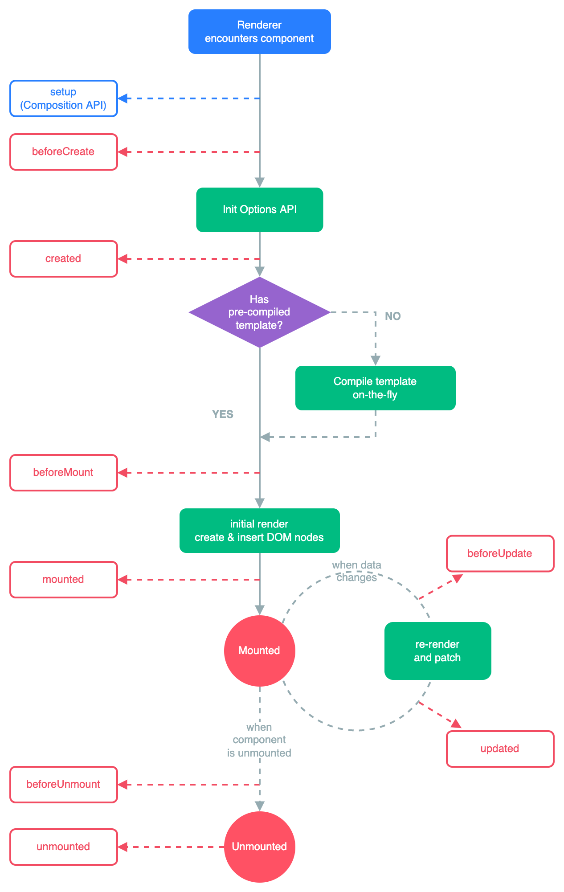
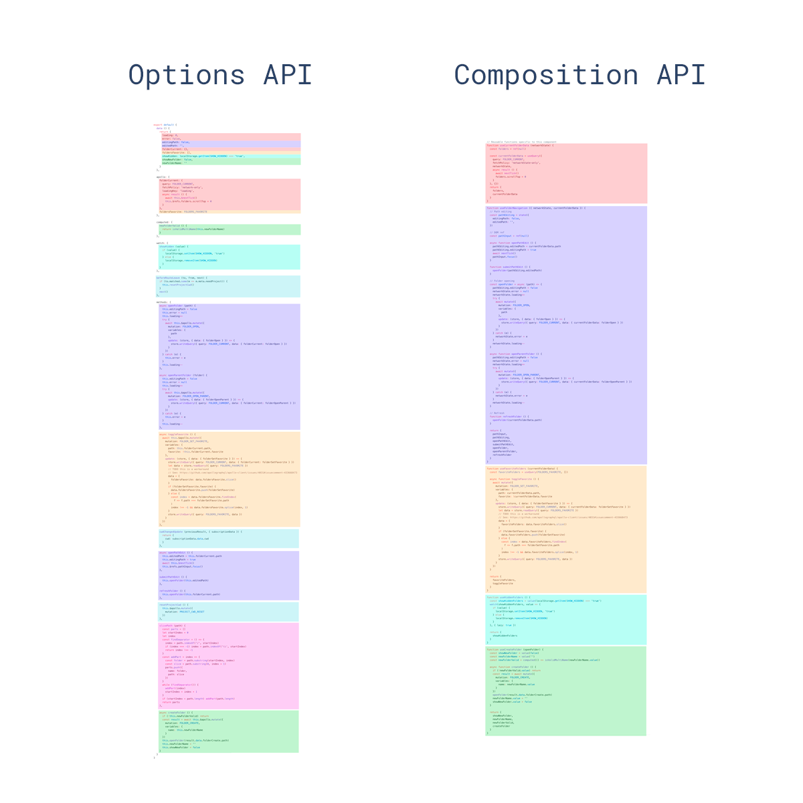

# VueJS Fragen

## Hauptmerkmale

- `Virtueller DOM`: Es wird ein virtueller DOM verwendet, ähnlich wie bei anderen bestehenden Frameworks wie ReactJS, Ember usw. Virtuelles DOM ist eine leichtgewichtige In-Memory-Baumdarstellung des ursprünglichen HTML-DOM und wird aktualisiert, ohne das ursprüngliche DOM zu beeinflussen.
- `Components`: Werden verwendet, um wiederverwendbare benutzerdefinierte Elemente in VueJS-Anwendungen zu erstellen.
- `Templates`: VueJS bietet HTML-basierte Templates, die das DOM mit den Daten der Vue-Instanz verbinden.
- `Routing`: Die Navigation zwischen Seiten wird durch vue-router erreicht
- `Light weight`: VueJS ist eine leichtgewichtige Bibliothek im Vergleich zu anderen Frameworks.

## Lifecycle

- `Creation (Initialization)`: Erstellungs-Hooks ermöglichen es Ihnen, Aktionen auszuführen, bevor Ihre Komponente überhaupt dem DOM hinzugefügt worden ist. Sie müssen diese Hooks verwenden, wenn Sie Dinge in Ihrer Komponente sowohl während des Client-Renderings als auch während des Server-Renderings einrichten müssen. Im Gegensatz zu anderen Hooks werden Creation Hooks auch während des serverseitigen Renderings ausgeführt.
  - `beforeCreate`: Dieser Hook läuft bei der Initialisierung Ihrer Komponente. Der Hook beobachtet Daten und Initialisierungsereignisse in Ihrer Komponente. Hier sind die Daten noch nicht reaktiv und die Ereignisse, die während des Lebenszyklus der Komponente auftreten, sind noch nicht eingerichtet.
  - `created`: Dieser Hook wird aufgerufen, wenn Vue Ereignisse und Datenbeobachtung eingerichtet hat. Hier sind die Ereignisse aktiv und der Zugriff auf reaktive Daten ist aktiviert, obwohl die Vorlagen noch nicht montiert oder gerendert wurden.
- `Mounting (DOM Insertion)`: Mounting Hooks sind oft die am häufigsten verwendeten Hooks und ermöglichen Ihnen den Zugriff auf Ihre Komponente unmittelbar vor und nach dem ersten Rendering.
  - `beforeMount`: Die beforeMount-Funktion ermöglicht Ihnen den Zugriff auf Ihre Komponente unmittelbar vor und nach dem ersten Rendering.
  - `mounted`: Dies ist ein häufig verwendeter Hook und Sie haben vollen Zugriff auf die reaktive Komponente, Templates und das gerenderte DOM (über this.$el). Die am häufigsten verwendeten Muster sind das Abrufen von Daten für Ihre Komponente.
- `Updating (Diff & Re-render)`: Aktualisierungshooks werden immer dann aufgerufen, wenn sich eine von Ihrer Komponente verwendete reaktive Eigenschaft ändert oder etwas anderes dazu führt, dass sie neu gerendert werden muss
  - `beforeUpdate`: Der beforeUpdate-Hook wird ausgeführt, nachdem sich die Daten in Ihrer Komponente geändert haben und der Aktualisierungszyklus beginnt, unmittelbar bevor das DOM gepatcht und neu gerendert wird.
  - `updated`: Dieser Hook wird ausgeführt, wenn sich die Daten in Ihrer Komponente ändern und das DOM neu gerendert wird.
- `Destruction (Teardown)`: Mit Zerstörungshaken können Sie Aktionen durchführen, wenn Ihre Komponente zerstört wird, z. B. Aufräumarbeiten oder das Senden von Analysen.
  - `beforeDestroy`: beforeDestroy wird unmittelbar vor dem Abriss ausgelöst. Wenn Sie Ereignisse oder reaktive Abonnements bereinigen müssen, wäre beforeDestroy wahrscheinlich der richtige Zeitpunkt dafür. Ihre Komponente ist dann immer noch vollständig vorhanden und funktionsfähig.
  - `destroyed`: Dieser Hook wird aufgerufen, nachdem Ihre Komponente zerstört wurde, ihre Direktiven ungebunden wurden und ihre Ereignis-Listener entfernt wurden.



## Conditional Directives

VueJS bietet eine Reihe von Direktiven, um Elemente basierend auf Bedingungen ein- oder auszublenden. 
Die verfügbaren Direktiven sind: `v-if`, `v-else`, `v-else-if` und `v-show`

1. `v-if`: Die `v-if`-Direktive fügt DOM-Elemente auf der Grundlage des angegebenen Ausdrucks hinzu oder entfernt sie. 
Zum Beispiel wird die Schaltfläche unten nicht angezeigt, wenn isLoggedIn auf false gesetzt ist.

```javascript
<button v-if="isLoggedIn">Logout</button>
```

2. `v-else`: Diese Direktive wird verwendet, um Inhalte nur dann anzuzeigen, wenn der an `v-if` angrenzende Ausdruck 
false ergibt. Dies ist vergleichbar mit dem else-Block in jeder Programmiersprache, um alternative Inhalte anzuzeigen, 
und ihm geht ein `v-if`- oder `v-else-if`-Block voraus. Sie brauchen diesem Block keinen Wert zu übergeben. 
Zum Beispiel wird `v-else` verwendet, um die Schaltfläche Anmelden anzuzeigen, wenn `isLoggedIn` auf `false` (nicht angemeldet) gesetzt ist.

```javascript
<button v-if="isLoggedIn"> Logout </button>
<button v-else> Log In </button>
```

3. `v-else-if`: Diese Direktive wird verwendet, wenn mehr als zwei Optionen geprüft werden sollen. Zum Beispiel soll ein 
Text anstelle der Schaltfläche "Anmelden" angezeigt werden, wenn die Eigenschaft `ifLoginDisabled` auf `true` gesetzt ist. 
Dies kann durch die `v-else`-Anweisung erreicht werden.

```javascript
<button v-if="isLoggedIn"> Logout </button>
<label v-else-if="isLoginDisabled"> User login disabled </label>
<button v-else> Log In </button>
```

4. `v-show`: Diese Direktive ist ähnlich wie `v-if`, aber sie rendert alle Elemente in das DOM und verwendet dann die 
CSS-Eigenschaft display, um Elemente ein- oder auszublenden. Diese Direktive wird empfohlen, wenn die 
Elemente häufig ein- und ausgeschaltet werden.

```javascript
<span v-show="user.name">Welcome user,{{user.name}}</span>
```

## vue Instance

Jede Vue-Anwendung funktioniert, indem eine neue Vue-Instanz mit der Vue-Funktion erstellt wird. 
Im Allgemeinen wird die Variable vm (kurz für ViewModel) verwendet, um auf die Vue-Instanz zu verweisen. 
Sie können eine Vue-Instanz wie unten beschrieben erstellen,

```javascript
var vm = new Vue({
  // options
})
```

Wie in den obigen Codeschnipseln erwähnt, müssen Sie das Objekt options übergeben. Die vollständige Liste 
der Optionen finden Sie in der API-Referenz.

## key Attribute

Um die Identität jedes Knotens zu verfolgen und somit vorhandene Elemente wiederzuverwenden und neu anzuordnen, 
müssen Sie für jedes Element in der `v-for`-Iteration ein eindeutiges Schlüsselattribut angeben. 
Ein idealer Wert für `key` wäre die eindeutige `ID` eines jeden Elements.

```javascript
<div v-for="item in items" :key="item.id">
        {{item.name}}
</div>
```

**Hinweis:** Sie sollten keine nicht-primitiven Werte wie Objekte und Arrays als `v-for`-Schlüssel verwenden. 
Verwenden Sie stattdessen Zeichenfolgen oder numerische Werte.

## Mutation Methoden

Wie der Name schon sagt, verändern die Mutationsmethoden das ursprüngliche Array.

Im Folgenden finden Sie eine Liste der Array-Mutationsmethoden, die Aktualisierungen der Ansicht auslösen.

- `push()`
- `pop()`
- `shift()`
- `unshift()`
- `splice()`
- `sort()`
- `reverse()`

Wenn Sie eine der oben genannten Mutationsmethoden auf der Liste durchführen, löst dies eine Aktualisierung der Ansicht aus. 
Zum Beispiel löst die push-Methode für das Array "items" eine Aktualisierung der Ansicht aus:

```javascript
vm.todos.push({ message: 'Baz' })
```

## Non-Mutation Methoden

Die Methoden, die das ursprüngliche Array nicht verändern, sondern immer ein neues Array zurückgeben, werden Nicht-Mutationsmethoden genannt.

Nachfolgend finden Sie die Liste der Nicht-Mutationsmethoden,

- `filtern()`
- `concat()`
- `slice()`

Nehmen wir zum Beispiel eine ToDo-Liste, bei der das alte Array durch ein neues ersetzt wird, das auf einem Statusfilter basiert:
```javascript
vm.todos = vm.todos.filter(function (todo) {
  return todo.status.match(/Completed/)
})
```

Bei diesem Ansatz wird aufgrund der VueJS-Implementierung nicht die gesamte Liste neu gerendert.

##  Event Modifiers

Normalerweise bietet Javascript `event.preventDefault()` oder `event.stopPropagation()` innerhalb von Event-Handlern. 
Sie können die von Vue bereitgestellten Methoden verwenden, aber diese Methoden sind für die Datenlogik und nicht 
für den Umgang mit DOM-Ereignissen gedacht. Vue bietet untenstehende Ereignis-Modifikatoren für `v-on` und 
diese Modifikatoren sind Direktiven-Postfixe, die durch einen Punkt gekennzeichnet sind.

- `.stop`
- `.prevent`
- `.capture`
- `.self`
- `.once`
- `.passive`

Nehmen wir ein Beispiel für einen Stop-Modifikator:

```javascript
vm.todos = vm.todos.filter(function (todo) {
  return todo.status.match(/Completed/)
})
```

Sie können auch Modifikatoren wie unten beschrieben verketten,

```javascript
<!-- modifiers can be chained -->
<a v-on:click.stop.prevent="doThat"></a>
```

# Key Modifiers

Vue unterstützt Tastenmodifikatoren auf `v-on` für die Behandlung von Tastaturereignissen. 

```javascript
<!-- only call `vm.show()` when the `keyCode` is 13 -->
<input v-on:keyup.13="show">
```

# Two-Way Binding

Sie können die `v-model`-Direktive verwenden, um bidirektionale Datenbindungen für Formulareingabe-, 
Textarea- und Select-Elemente zu erstellen.

```javascript
<input v-model="message" placeholder="Enter input here">
  <p>The message is: {{ message }}</p>
```

Denken Sie daran, dass `v-model` die `value`, `checked` or `selected` Attribute von Formularelementen ignoriert. 
Es verwendet also immer die Daten der Vue-Instanz als Quelle der Wahrheit.

## Props

Props sind benutzerdefinierte Attribute, die Sie für eine Komponente registrieren können. 
Wenn ein Wert an ein prop-Attribut übergeben wird, wird er zu einer Eigenschaft dieser Komponenteninstanz. 
Sie können diese Liste von Werten als Props-Option übergeben und sie ähnlich wie Datenvariablen in der Vorlage verwenden.

```javascript
Vue.component('todo-item', {
  props: ['title'],
  template: '<h2>{{ title }}</h2>'
})
```

Sobald die Props registriert sind, können Sie sie als benutzerdefinierte Attribute übergeben.

```javascript
<todo-item title="Learn Vue conceptsnfirst"></todo-item>
```

## Slots

Vue implementiert eine API zur Verteilung von Inhalten, die das Element verwendet, um als Verteilungsstellen für 
Inhalte zu dienen, die nach dem aktuellen Entwurf der Web Components Spec erstellt wurden.

```javascript
Vue.component('alert', {
  template: `
    <div class="alert-box">
      <strong>Error!</strong>
      <slot></slot>
    </div>
  `
})
```

Jetzt können Sie dynamische Inhalte wie unten dargestellt einfügen:

```javascript
<alert>
  There is an issue with in application.
</alert>
```

## Composition API

Die Composition API ist eine Reihe von APIs, die es uns ermöglicht, Vue-Komponenten mit importierten Funktionen zu 
erstellen, anstatt Optionen zu deklarieren.

- [Reactivity API](https://vuejs.org/api/reactivity-core) z. B. `ref()` und `reactive(), mit der wir direkt reaktive Zustände, berechnete Zustände und Watcher erstellen können.
- [Lifecycle Hooks](https://vuejs.org/api/composition-api-lifecycle), z.B. `onMounted()` und `onUnmounted()`, die es uns ermöglichen, programmatisch in den Lebenszyklus der Komponente einzugreifen.
- [Dependency Injection](https://vuejs.org/api/composition-api-dependency-injection), d.h. provide()` und `inject()`, die es uns ermöglichen, das Dependency Injection System von Vue zu nutzen, während wir Reactivity APIs verwenden.

Composition API ist ein eingebautes Feature von Vue 3!
```javascript
<script setup>
  import { ref, onMounted } from 'vue'

  // reactive state
  const count = ref(0)

  // functions that mutate state and trigger updates
  function increment() {
  count.value++
}

  // lifecycle hooks
  onMounted(() => {
  console.log(`The initial count is ${count.value}.`)
})
</script>

<template>
  <button @click="increment">Count is: {{ count }}</button>
</template>
```




